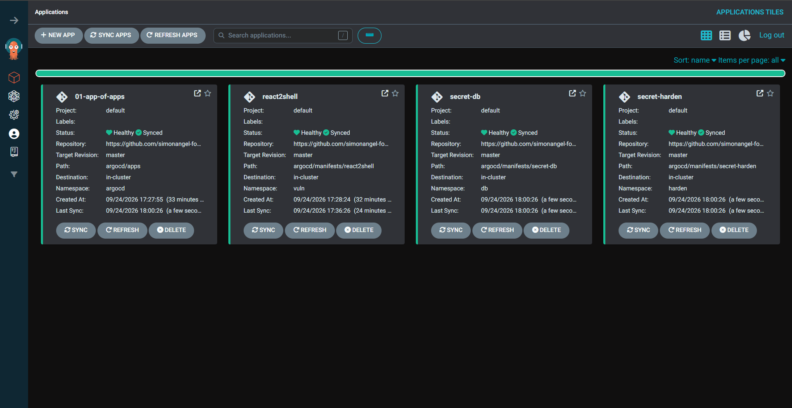
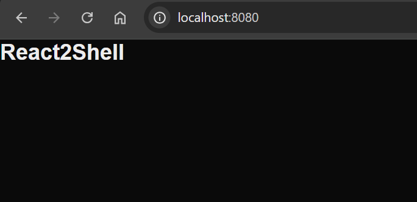

# kind cluster

[Back](../README.md)

- [kind cluster](#kind-cluster)
  - [Steps](#steps)
  - [Create kind](#create-kind)
  - [Argo CD and Manifests](#argo-cd-and-manifests)
  - [Create secret](#create-secret)

---

## Steps

| #   | Steps               | Step                      |
| --- | ------------------- | ------------------------- |
| 1   | create kind cluster | create kind cluster       |
| 2   | argocd              | create argocd app-of-apps |
| 3   | create secret       | dummy crown jewels        |

## Create kind

```sh
# Create the cluster from the pinned config.
kind create cluster --config kind/kind-config.yaml

# Verify: context, nodes Ready, system pods running.
kubectl config use-context kind-secure-aks
kubectl get nodes -o wide
kubectl get pods -A

# clean up
# kind delete cluster --name secure-aks
```

---

## Argo CD and Manifests

GitOps via Argo CD, app-of-apps.

```txt
argocd/
  root-app.yaml                    # app-of-apps root (apply by hand)
  apps/react2shell.yaml            # child Application
  manifests/react2shell/           # the vulnerable app (ns, deployment, service)
```

```sh
# ##############################
# install argocd
# ##############################
helm repo add argo https://argoproj.github.io/argo-helm
helm repo update argo
# Hang tight while we grab the latest from your chart repositories...
# ...Successfully got an update from the "argo" chart repository
# Update Complete. ⎈Happy Helming!⎈

# install argocd
helm install argocd argo/argo-cd --namespace argocd --create-namespace

# get pwd
kubectl -n argocd get secret argocd-initial-admin-secret -o jsonpath="{.data.password}" | base64 --decode; echo
# port forward
kubectl port-forward service/argocd-server -n argocd 8000:443

# ##############################
# deploy app-of-apps
# ##############################
git add argocd
git commit -m "argocd: app-of-apps + react2shell manifests"
git push

kubectl apply -n argocd -f argocd/root-app.yaml

# Verify
kubectl -n argocd get applications
kubectl -n argocd get secret argocd-initial-admin-secret \
  -o jsonpath='{.data.password}' | base64 -d; echo
```

- argo cd



- app



---

## Create secret

| secret            | tier    | type    | ns     | value                     | description                   |
| ----------------- | ------- | ------- | ------ | ------------------------- | ----------------------------- |
| secret-pod-vuln   | pod     | generic | vuln   | pwd="pod-hello-world"     | secret mounted on pod in ENV; |
| secret-pod-harden | pod     | generic | harden | pwd="pod-hello-world"     | secret mounted on pod in ENV; |
| secret-cluster    | cluster | generic | db     | pwd="cluster-hello-world" | secret in different ns;       |

- defer:
  - host tier sensitive data
  - cloud tier sensitive data

```sh
# confirm
kubectl get secret -A | grep -E 'secret-(pod|cluster)'
# db            secret-cluster                 Opaque                          1      4m2s
# harden        secret-pod-harden              Opaque                          1      4m2s
# vuln          secret-pod-vuln                Opaque                          1      3m28s

# confirm the pod-tier secret
kubectl -n vuln exec deploy/react2shell -- printenv PWD_SECRET
# pod-hello-world
```
